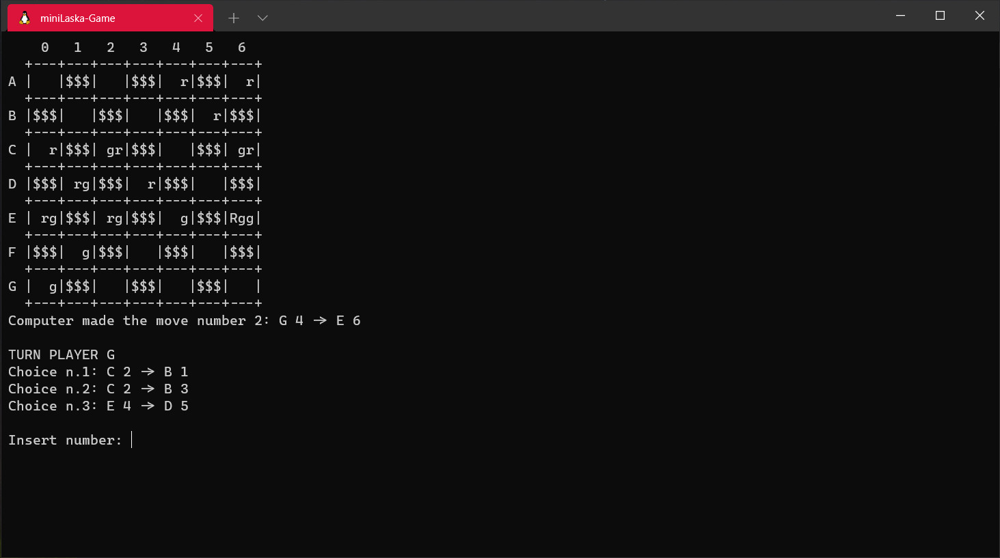

<p align="center">
  <a href="https://github.com/EdoardoTosin/miniLaska-Game">
    </a>
</p>

## Table of contents
* [General info](#general-info)
* [Rules](#rules)
* [Setup](#setup)
* [Documentation](#documentation)
* [License](#license)

## General info
This project is a variant of the game called Lasca (or Laska).



## Rules
The major difference between Lasca and other draughts variants is that instead of pieces being removed from the board when they are jumped, they are placed under the piece that jumped them, forming a column. A column is under the control of the player whose piece is on top, and has the move and jump capabilities of that piece (so that, for instance, a column with a black officer on top is under Black's control, and can move and jump in either direction.) If a column is itself jumped, only the top piece is removed to go under the column doing the jumping.

There are a few other changes in the rules, as well. Capturing is mandatory when possible; this means that a clever player may be able to force his opponent to capture several pieces of his color, then capture his opponent's piece from the top, leaving a powerful column composed of several pieces of his own color. A player wins the game when:

* the opponent has no legal move, or
* all the opponent's pieces have been captured, or
* the opponent resigns.

Source: [Wikipedia](https://en.wikipedia.org/wiki/Lasca)

Also, in this variant of Lasca, the height of a tower can be up to three checkers.

## Setup
To run this project, compile it locally using make and have fun.

### For Windows users:
* Install Mingw-w64 via the [SourceForge](https://sourceforge.net/projects/mingw-w64/) website
* Add the path to your Mingw-w64 bin folder to the Windows PATH environment variable
* Install [Chocolatey](https://chocolatey.org/install) package manager and then install make with the command
  ```choco install make```
* Download the project from [here](https://github.com/EdoardoTosin/miniLaska-Game/archive/main.zip) or via ``git clone``
* Run the following commands:

  ```
  $ make
  $ .\miniLaska
  ```

### For Linux users:
Run the following commands on terminal:
```
$ git clone https://github.com/EdoardoTosin/miniLaska-Game.git
$ cd miniLaska-Game
$ ./build.sh
$ ./run.sh
```

## Documentation

Doxygen documentation of the project is available [here](https://edoardotosin.github.io/miniLaska-Game/html/index.html).

## License

Copyright (c) 2021 [Singh Baljinder](https://github.com/SinghBaljinder) & [Edoardo Tosin](https://github.com/EdoardoTosin)

This software is released under the terms of the GNU General Public License v3.0. See the [LICENSE](/LICENSE) file for further information.
